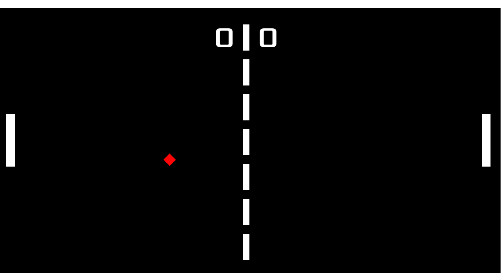
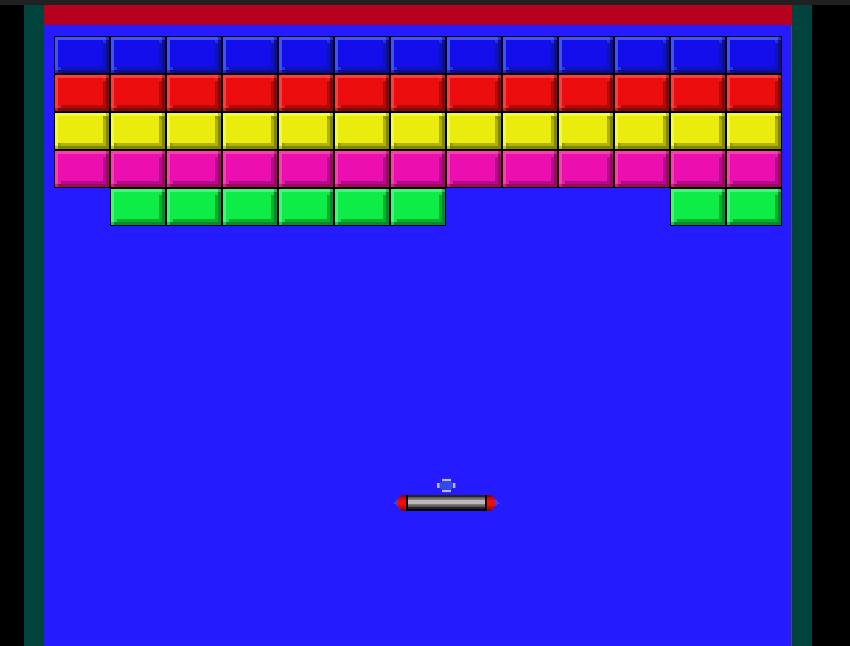

# 🎮 Popurrí de Juegos en Godot 🎮

¡Bienvenidos al proyecto de Popurrí de Juegos en Godot! Este repositorio contiene una colección de juegos clásicos desarrollados con el motor de videojuegos Godot. El objetivo de este proyecto es proporcionar una plataforma educativa para aprender y practicar el desarrollo de videojuegos.

## Juegos Incluidos

### 1. 🏓 Pong
El clásico juego de tenis de mesa. Controla tu paleta para devolver la pelota y gana puntos al hacer que tu oponente falle.

### 2. 🧱 Arkanoid
Destruye ladrillos con una pelota y una paleta. ¡Asegúrate de que la pelota no caiga fuera de la pantalla!

### 3. ❌🟢 TikTakToe (Próximamente)
El tradicional juego de tres en raya. ¡Sé el primero en alinear tres de tus símbolos en una fila!

### 4. 🀄 Solitario Chino (Próximamente)
Un juego de rompecabezas estratégico donde debes eliminar todos los clavitos del tablero saltando sobre ellos con otros clavitos.

### 5. 🐍 Snake (Próximamente)
Guía a la serpiente para que coma y crezca. Evita chocar contra las paredes y contra ti mismo.

## Orden de Desarrollo
1. Pong (¡Desarrollado!)
2. Arkanoid (¡Desarrollado!)
3. TikTakToe (Próximamente)
4. Solitario Chino (Próximamente)
5. Snake (Próximamente)

## Objetivo del Proyecto
Este proyecto es un ejercicio de práctica con fines educativos. Está diseñado para ayudar a los desarrolladores a mejorar sus habilidades en la creación de videojuegos utilizando Godot.

## Cómo Contribuir
Si deseas contribuir a este proyecto, por favor sigue estos pasos:

1. Haz un fork del repositorio.
2. Crea una nueva rama (`git checkout -b feature-nueva-rama`).
3. Realiza tus cambios y haz commits (`git commit -m 'Agrega nueva característica'`).
4. Sube tus cambios (`git push origin feature-nueva-rama`).
5. Abre un Pull Request.

## Requisitos del Sistema
- Godot Engine 3.5 o superior
- Sistema operativo: Windows, macOS, Linux

## Instalación
1. Clona este repositorio: `git clone https://github.com/tu_usuario/popurri-juegos-godot.git`
2. Abre Godot y carga el proyecto.

## Capturas de Pantalla

---

¡Esperamos que disfrutes aprendiendo y desarrollando con este proyecto! Si tienes alguna pregunta o sugerencia, no dudes en abrir un issue.

¡Feliz desarrollo! 🎮
-------------------------------------------------------------------------------------------------------------------------------------------------------------------------------------

# 🎮 Godot Games Medley 🎮

Welcome to the Godot Games Medley project! This repository contains a collection of classic games developed with the Godot game engine. The aim of this project is to provide an educational platform for learning and practicing game development.

## Included Games

### 1. 🏓 Pong
The classic table tennis game. Control your paddle to return the ball and score points by making your opponent miss.

### 2. 🧱 Arkanoid
Break bricks with a ball and a paddle. Make sure the ball doesn't fall off the screen!

### 3. ❌🟢 TikTakToe (Coming Soon)
The traditional tic-tac-toe game. Be the first to align three of your symbols in a row!

### 4. 🀄 Chinese Solitaire (Coming Soon)
A strategic puzzle game where you aim to remove all the pegs from the board by jumping over them with other pegs.

### 5. 🐍 Snake (Coming Soon)
Guide the snake to eat and grow. Avoid crashing into the walls or yourself.

## Development Order
1. Pong (Developed!)
2. Arkanoid (Developed!)
3. TikTakToe (Coming soon)
4. Chinese Solitaire (Coming soon)
5. Snake (Coming soon)

## Project Objective
This project is an educational exercise intended for practice purposes. It is designed to help developers improve their skills in creating video games using Godot.

## How to Contribute
If you would like to contribute to this project, please follow these steps:

1. Fork the repository.
2. Create a new branch (`git checkout -b feature-new-branch`).
3. Make your changes and commit them (`git commit -m 'Add new feature'`).
4. Push your changes (`git push origin feature-new-branch`).
5. Open a Pull Request.

## System Requirements
- Godot Engine 3.5 or higher
- Operating System: Windows, macOS, Linux

## Installation
1. Clone this repository: `git clone https://github.com/your_username/godot-games-medley.git`
2. Open Godot and load the project.

## Screenshots

---

We hope you enjoy learning and developing with this project! If you have any questions or suggestions, feel free to open an issue.

Happy developing! 🎮
